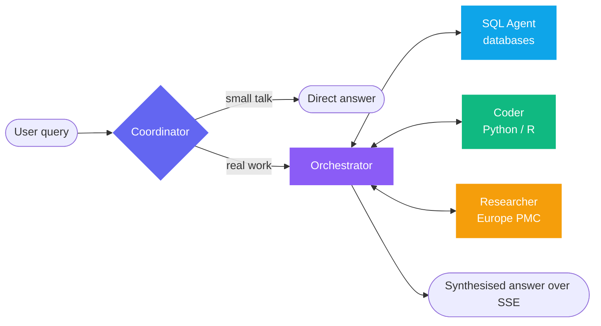

<div align="center">

# 🧬 GenomeChat

**Talk to genomics data in plain language**

A full-stack, multi-agent platform for genomics research. Ask a question in plain English; the system plans the work, queries the databases, runs analysis code, and streams a synthesised answer back.

[](https://www.python.org/)
[](https://fastapi.tiangolo.com/)
[](https://github.com/langchain-ai/langgraph)
[](https://react.dev/)
[](https://www.typescriptlang.org/)
[](https://vite.dev/)
[](https://www.mongodb.com/)
[](https://www.docker.com/)

### [🚀 Try the live demo →](https://xukanz.github.io/genomechat/)

The full frontend walkthrough: landing → login → chat, with worked examples and charts.
**No backend, no sign-up** — it runs entirely in your browser.

[简体中文](./README.md) · **English**

</div>

---

## ✨ What is this

GenomeChat automates everything between *asking a genomics question* and *getting a reproducible answer with charts and citations*.

You ask: *"How many pathogenic variants are on BRCA1? Plot the distribution by molecular consequence."*

The system **plans** → generates and validates SQL → **queries** ClinVar → **executes** Python in a sandbox to plot → searches the **literature** for support → **synthesises** an answer, streamed token by token.

<table>
<tr>
<td width="50%" valign="top">

### 🤖 Multi-agent
A five-node LangGraph: a coordinator routes, an orchestrator plans, workers execute

</td>
<td width="50%" valign="top">

### 🗄️ Three public databases
ClinVar / GWAS Catalog / Ensembl, hot-swappable at runtime — no restart

</td>
</tr>
<tr>
<td width="50%" valign="top">

### 🔬 Sandboxed execution
Python and R run as separate services: non-root, read-only rootfs, resource caps

</td>
<td width="50%" valign="top">

### 📊 Full observability
OpenTelemetry spans for every node, tool call, and LLM request, exported to MongoDB

</td>
</tr>
</table>

---

## 🧠 Agent architecture



| Node | Responsibility |
|---|---|
| 🧭 **Coordinator** | Entry point. Small talk gets answered directly, real work is handed off |
| 🎯 **Orchestrator** | Plans multi-step tasks, routes to one worker at a time, synthesises the final answer |
| 💻 **Coder** | Generates and executes Python or R in a sandboxed service |
| 🗃️ **SQL Agent** | Schema-aware SQL generation with a validation and safety pipeline |
| 📚 **Researcher** | Searches scientific literature through the public [Europe PMC](https://europepmc.org/) API |

> **The Summarizer is not a node** — it's a `SummarizationMiddleware` on the orchestrator, running on its own (cheaper) model to compress the history when the context window fills.

Worker nodes always hand control back to the orchestrator — that's the one back-edge rule in this graph.

**Research modes**: `Standard` for efficient, direct responses · `Deep Research` for multi-faceted analysis with iterative deepening and findings passed between agents.

---

## 🧬 Data sources

Three database profiles ship by default, all built from public genomics resources. Switch between them at runtime from the UI or the API.

| Profile | Source | Storage | License |
|---|---|---|---|
| 🩺 **clinvar** | [NCBI ClinVar](https://www.ncbi.nlm.nih.gov/clinvar/) variant/condition assertions | SQLite, built locally | Public domain |
| 📈 **gwas** | [NHGRI-EBI GWAS Catalog](https://www.ebi.ac.uk/gwas/) associations + studies | Parquet via DuckDB | CC BY 4.0 |
| 🧾 **ensembl** | [Ensembl](https://www.ensembl.org/) GRCh38 gene annotation | Parquet via DuckDB | EMBL-EBI, no restrictions |

Build them before first run:

```bash
cd backend
uv run python scripts/build_genomics_databases.py --download
```

<details>
<summary><b>📦 Build details (disk, time, skipping profiles, upgrading Ensembl)</b></summary>

<br>

This downloads roughly **640 MB** of source files into `backend/databases/_raw/` and produces:

- `databases/clinvar/clinvar.db` — ~1.7 GB, 4.5M rows
- `databases/gwas/*.parquet`
- `databases/ensembl/*.parquet` — ~40 MB

Both the raw downloads and the built artifacts are gitignored — **every checkout rebuilds them**.

The ClinVar build keeps GRCh38 rows only; pass `--clinvar-full` to keep every assembly (roughly double).

Budget about **20 minutes** for the first run, most of it download time. Skip individual profiles with `--skip-clinvar`, `--skip-gwas`, `--skip-ensembl`.

The `ensembl` profile is built from the **release-116** GTF. The release is pinned rather than tracking `current`, because Ensembl bakes the release number into the filename and a silent upgrade would invalidate the row counts quoted in the schema description. Move to a newer release with:

```bash
uv run python scripts/build_genomics_databases.py --download \
  --ensembl-release 117 --skip-clinvar --skip-gwas
```

</details>

---

## 🚀 Quick start

### 👀 Just want to see what it looks like?

Skip the backend entirely and run the frontend demo — it ships with a mocked API and covers the
landing page, login, and a chat page with worked examples:

```bash
cd frontend && npm install
npm run dev               # → http://localhost:5173/demo.html
```

Or just open the [hosted version](https://xukanz.github.io/genomechat/). To run the real system,
read on.

### Prerequisites

| Required | Optional |
|---|---|
| Python 3.12+ · [uv](https://docs.astral.sh/uv/) | AWS S3 (persisting generated files) |
| Node.js 18+ | R (for the R sandbox) |
| MongoDB | Docker |
| An LLM provider | |

> ⚠️ **MongoDB is required**, and not only for checkpoints — user accounts, conversations, projects, reports, and file metadata all live there.

### 🐳 Option 1: Docker Compose (recommended)

```bash
cp backend/.env.example backend/.env
touch sandbox/.env r-sandbox/.env      # compose requires these files to exist
cd docker && docker compose up -d
```

| Service | URL |
|---|---|
| 🖥️ Frontend | http://localhost:3100 |
| ⚙️ Backend | http://localhost:8000 |
| 🐍 Python sandbox | http://localhost:8080 |
| 📊 R sandbox | http://localhost:8081 |

> MongoDB is **not** part of the compose file — point `MONGODB_CONNECTION_STRING` at a reachable instance.

### 🔧 Option 2: Local development

<details open>
<summary><b>Backend</b></summary>

```bash
cd backend

# Install uv if needed
curl -LsSf https://astral.sh/uv/install.sh | sh

uv python pin 3.12
uv sync

cp .env.example .env      # edit .env — see Configuration below

uv run python scripts/build_genomics_databases.py --download   # first run only

uv run python main.py     # → http://localhost:8000
```

</details>

<details>
<summary><b>Frontend</b></summary>

```bash
cd frontend
npm install
echo "VITE_API_URL=http://localhost:8000" > .env
npm run dev               # → http://localhost:5173
```

</details>

<details>
<summary><b>Sandbox (⚠️ one gotcha)</b></summary>

```bash
cd sandbox
uv venv --python 3.12 .venv
uv pip install --python .venv/bin/python -r requirements.txt
SANDBOX_JOBS_DIR=./.sandbox_jobs .venv/bin/python server.py    # → http://localhost:8080
```

`SANDBOX_JOBS_DIR` is only needed outside Docker — in a container the default `/sandbox/jobs` tmpfs mount is used.

**Launch with `.venv/bin/python`, not a bare `python`.** Jobs run under the same interpreter as the server, so starting it with the system Python gives the agent a sandbox with no matplotlib, numpy, or pandas — it will then try to `pip install` them on **every single job**, into a directory that is deleted as soon as the job ends.

</details>

---

## ⚙️ Configuration

`backend/.env.example` is the authoritative reference and documents every setting. These two are **required**, and the backend will not start without them:

```bash
JWT_SECRET_KEY=...             # python -c 'import secrets; print(secrets.token_urlsafe(32))'
MONGODB_CONNECTION_STRING=mongodb://localhost:27017
```

Plus credentials for whichever LLM provider `backend/src/config/agents.py` targets. `src/service/llm.py` supports direct Anthropic and OpenAI as well as gateway-fronted Azure, Bedrock, and GCP.

<details>
<summary><b>📁 Generated files and S3 — what you lose without it</b></summary>

<br>

S3 is the artifact store for everything the agents produce: charts from the coder, result CSVs from the SQL agent, and anything else written during code execution. Records land in the MongoDB `files` collection and are served through `/artifacts` as presigned URLs.

```bash
AWS_ACCESS_KEY_ID=...          # omit both keys to use the boto3 default chain
AWS_SECRET_ACCESS_KEY=...      # (IAM role, instance profile, ~/.aws/credentials)
AWS_SESSION_TOKEN=...          # only for temporary credentials
AWS_DEFAULT_REGION=us-east-1   # default
AWS_DEFAULT_BUCKET=my-bucket   # required for uploads to happen at all
ALLOWED_S3_BUCKETS=a,b         # optional whitelist; unset means any bucket
```

**Both services need these.** The backend reads them via `settings` (`src/service/s3.py`), and the sandbox injects its own copy into each job's restricted environment (`sandbox/server.py`), so code running in the sandbox can upload directly. `AWS_DEFAULT_BUCKET` is only passed through when non-empty — an empty value is logged and dropped, which reads in the log as `[ENV] AWS_DEFAULT_BUCKET is not set`.

**Running without S3 works, with real limits:**

| Impact | Detail |
|---|---|
| 📉 Large files dropped | The sandbox caps inline base64 at 1 MB per file and drops anything larger (logged as `Not returning <path>`) |
| 🔥 Context burn | A 95 KB chart is roughly 127,000 base64 characters — about 32K tokens — spent from the agent's context window |
| 🕳️ Nothing persisted | `/artifacts` stays empty, and reopening the conversation will not bring the file back |

Fine for trying things out; configure S3 for anything beyond a couple of charts per conversation.

**Self-hosted S3 (MinIO)** — set `AWS_ENDPOINT_URL` to use an S3-compatible server instead of AWS. MinIO needs no account and runs from a single binary:

```bash
# Download once (Linux x86_64; see https://min.io/download for other platforms)
curl -fsSLO https://dl.min.io/server/minio/release/linux-amd64/minio && chmod +x minio

MINIO_ROOT_USER=minioadmin MINIO_ROOT_PASSWORD=minioadmin \
  ./minio server ~/.minio-data --console-address :9001
```

The console is at http://localhost:9001; create a bucket there, then point both services at it — `backend/.env` and `sandbox/.env` each need their own copy:

```bash
AWS_ENDPOINT_URL=http://localhost:9000
AWS_ACCESS_KEY_ID=minioadmin
AWS_SECRET_ACCESS_KEY=minioadmin
AWS_DEFAULT_BUCKET=genomechat
AWS_DEFAULT_REGION=us-east-1
```

Addressing style is handled automatically: setting `AWS_ENDPOINT_URL` switches boto3 to path-style, because a self-hosted server reached by host:port cannot serve `http://<bucket>.localhost:9000`. Override with `AWS_S3_ADDRESSING_STYLE` (`auto`, `path`, `virtual`) if your server wants something else.

Under Docker Compose, `localhost` inside a container is that container — use the MinIO service name, or `host.docker.internal` when MinIO runs on the host.

</details>

<details>
<summary><b>📡 Observability</b></summary>

<br>

OpenTelemetry spans for every node, tool call, and LLM request, exported to MongoDB and optionally to Langfuse. Attributes follow the OTel GenAI semantic conventions, so third-party dashboards render them without translation.

```bash
OTEL_ENABLED=true
TRACE_STORAGE_ENABLED=true
```

Then `GET /internal/traces` after a chat turn. Access is tenant-scoped, audited, and rate-limited.

</details>

<details>
<summary><b>🪟 Context window management</b></summary>

<br>

Long conversations are summarised automatically at **70%** of the model's input window, and stale tool outputs are cleared independently. Configurable via the `CONTEXT_*` settings.

</details>

---

## 🧰 Tools available to agents

Not every tool goes to every agent — the coder gets the file and code-execution tools, the orchestrator gets `manage_plan` only, and the SQL agent gets the schema, sampling, and pipeline tools.

| Category | Tools |
|---|---|
| 🗃️ **Database** | `execute_sql_query` · `execute_sql_query_and_save` · `get_database_schema` · `get_random_subsamples` |
| 📁 **Files** | `list_files_by_thread` · `list_files_by_type` · `read_file_from_s3` · `list_s3_files` |
| ▶️ **Code execution** | `execute_code` (Python) · `execute_r_code` (R) |
| 📚 **Research** | `search_literature` · `search_by_doi` · `get_paper_citations` · `get_literature_stats` |
| 📋 **Planning** | `manage_plan` — the orchestrator's todo list; its updates are streamed to the UI as plan events |
| 🔎 **SQL pipeline** | `execute_sql_pipeline` — used by the agentic SQL graph to generate, validate, and run a query in one call |

---

## 🔌 API

Interactive docs are served at `/docs` (Swagger UI) and `/redoc`.

<details>
<summary><b>🔐 Authentication <code>/auth</code></b></summary>

| Method | Path | Description |
|---|---|---|
| `POST` | `/auth/register` | User registration |
| `POST` | `/auth/login` | Login (OAuth2 password flow) |
| `POST` | `/auth/refresh` | Refresh access token |
| `GET` | `/auth/me` | Current user info |
| `POST` | `/auth/logout` | Logout |

</details>

<details>
<summary><b>💬 Chat <code>/chat</code> · <code>/conversations</code></b></summary>

| Method | Path | Description |
|---|---|---|
| `POST` | `/chat` | Synchronous chat |
| `POST` | `/chat/stream` | Streaming chat over Server-Sent Events |
| `GET` | `/conversations` | List the caller's conversations (optionally filtered by project) |
| `GET` | `/conversations/{id}` | Conversation metadata |
| `GET` | `/conversations/{id}/history` | Replay the stored message history |
| `PATCH` | `/conversations/{id}` | Rename |
| `DELETE` | `/conversations/{id}` | Delete |

</details>

<details>
<summary><b>🗄️ Databases <code>/databases</code></b></summary>

| Method | Path | Description |
|---|---|---|
| `GET` | `/databases` | List available profiles |
| `GET` | `/databases/active` | Currently active profile |
| `GET` | `/databases/{id}` | Profile detail (type, SQL dialect, domain, example questions) |
| `POST` | `/databases/{id}/connect` | Switch active profile |

</details>

<details>
<summary><b>📂 Projects <code>/projects</code></b></summary>

Projects group conversations, own reusable code snippets, and can be shared with other users.

| Method | Path | Description |
|---|---|---|
| `GET` | `/projects` | List owned and shared-with-me projects |
| `POST` | `/projects` | Create |
| `GET`·`PATCH`·`DELETE` | `/projects/{id}` | Read, update, delete (the default project cannot be deleted) |
| `POST` | `/projects/{id}/conversations/{cid}/move` | Move a conversation between projects |
| `GET`·`POST` | `/projects/{id}/shares` | List or grant shared access |
| `DELETE` | `/projects/{id}/shares/{user_id}` | Revoke shared access |
| `GET`·`POST` | `/projects/{id}/snippets` | List or create snippets injected into the coder prompt |
| `PUT`·`DELETE` | `/projects/{id}/snippets/{sid}` | Update or delete a snippet |
| `PATCH` | `/projects/{id}/snippets/{sid}/toggle` | Enable/disable without deleting |

</details>

<details>
<summary><b>📎 Artifacts <code>/artifacts</code></b></summary>

Files produced by the coder and SQL agents, tracked in MongoDB and stored in S3. **Without S3 configured these endpoints return nothing** — see "Generated files and S3" above.

| Method | Path | Description |
|---|---|---|
| `GET` | `/artifacts` | List generated files (filter by thread, project, file type, or content type; paginated) |
| `GET` | `/artifacts/{file_id}/download` | Presigned download URL |
| `POST` | `/artifacts/batch-download-urls` | Presigned URLs for many files at once |

</details>

<details>
<summary><b>📄 Reports <code>/reports</code> · Feedback <code>/feedback</code> · Users <code>/users</code></b></summary>

| Method | Path | Description |
|---|---|---|
| `GET` | `/reports` | List saved reports |
| `POST` | `/reports` | Save an assistant answer as a report |
| `GET` | `/reports/check?conversation_id=&message_index=` | Whether a given message has already been saved |
| `GET` | `/reports/conversation/{id}` | Reports saved from one conversation |
| `GET`·`PATCH`·`DELETE` | `/reports/{id}` | Read, update, delete |
| `POST` | `/feedback` | Create or update thumbs up/down on a message |
| `GET` | `/feedback/message?conversation_id=&message_index=` | Feedback for a single message |
| `GET` | `/feedback/conversation/{id}` | All feedback in a conversation |
| `DELETE` | `/feedback/{feedback_id}` | Delete by id |
| `DELETE` | `/feedback/message/{cid}/{index}` | Delete by message position |
| `GET` | `/users/search` | Look up users by email or name (used by the project share dialog) |
| `PATCH` | `/users/me` | Update the caller's profile |

</details>

<details>
<summary><b>🔬 Internal <code>/internal</code> · Health <code>/health</code></b></summary>

`/internal` is gated by `INTERNAL_OBSERVABILITY_ENABLED`.

| Method | Path | Description |
|---|---|---|
| `GET` | `/internal/traces` | Query captured spans |
| `GET` | `/internal/traces/raw` | Raw transcript access; reserved for a later phase, currently returns `501` |
| `GET` | `/internal/memory` | Inspect extracted memories |
| `POST` | `/internal/memory/consolidate` | Trigger a consolidation pass on demand |
| `GET` | `/health` | Health check |
| `GET` | `/health/detailed` | MongoDB and Python-sandbox connectivity plus a redacted config summary; reports `degraded` if either is unreachable |

</details>

---

## 🏗️ Architecture

```
genomechat/
├── backend/                     # Platform backend services
│   ├── src/
│   │   ├── agents/              # LangGraph agents (Coordinator, Orchestrator, Coder, SQL Agent)
│   │   ├── api/                 # FastAPI routes and application
│   │   ├── config/              # Configuration (settings, database registry)
│   │   ├── graph/               # LangGraph state and builder
│   │   ├── models/              # Pydantic models
│   │   ├── prompts/             # Agent system prompts (with per-database context)
│   │   ├── service/
│   │   │   ├── database/        # Connections (SQLite, DuckDB, MySQL, Postgres, …)
│   │   │   ├── memory/          # Memory pipeline (Phase 0.5, default off)
│   │   │   └── observability/   # OpenTelemetry tracing + MongoDB exporter
│   │   ├── tools/               # LangChain tools for agents
│   │   └── utils/               # Utility functions
│   ├── databases/               # Built database artifacts (see Data sources)
│   ├── scripts/                 # Data preparation, audits, migrations
│   └── tests/                   # Test suite
├── frontend/                    # React + TypeScript SPA
├── sandbox/                     # Python code execution sandbox (separate service)
├── r-sandbox/                   # R code execution sandbox (separate service)
├── docker/                      # Docker Compose files (dev + prod)
└── docs/                        # Documentation
```

### State management

**Backend** — LangGraph checkpoints in MongoDB, thread IDs of the form `{user_id}:{conversation_id}`, and a runtime-switchable database registry. Request-scoped state (active database, agent backend) is carried in `ContextVar`s so concurrent requests never interfere.

**Frontend** — Zustand stores for auth, conversations, projects, databases, artifacts, feedback, reports, snippets, and UI state.

### Streaming

Server-Sent Events carry token-by-token output, plan updates, agent start/end events, tool events, and generated file metadata.

---

## 🔒 Security

- 🔑 JWT authentication with refresh tokens; bcrypt password hashing
- 🛡️ SQL agent validation pipeline: LLM review, DDL rejection, automatic row limits
- 📦 Code execution isolated in a separate container — non-root, read-only root filesystem, tmpfs scratch, `no-new-privileges`, PID cap, and per-process resource limits
- 📋 Table whitelisting per database profile

---

## 🧪 Development

```bash
cd backend

uv run pytest                              # test suite
uv run pytest --cov=src --cov-report=html  # with coverage
uv run pytest tests/test_config/test_database_registry.py -v   # a single file
uv run ruff format .                       # format
uv run ruff check --fix .                  # lint
uv run mypy src/                           # type check
```

### CLI tool

An interactive CLI for testing without the frontend:

```bash
uv run python cli.py                         # streaming, standard mode
uv run python cli.py --no-stream             # clearer errors when debugging
uv run python cli.py --research-mode deep_research
```

Commands: `/help` · `/clear` · `/thread` · `/sync` · `/stream` · `/mode standard|deep` · `/login` · `/register` · `/logout` · `/whoami` · `/exit`

---

## 🙏 Acknowledgments

Built with [LangGraph](https://github.com/langchain-ai/langgraph), [LangChain](https://github.com/langchain-ai/langchain), FastAPI, and React.

Data courtesy of [NCBI ClinVar](https://www.ncbi.nlm.nih.gov/clinvar/), the [NHGRI-EBI GWAS Catalog](https://www.ebi.ac.uk/gwas/), and [Ensembl](https://www.ensembl.org/).

Literature search is powered by [Europe PMC](https://europepmc.org/), an open literature database developed and operated by EMBL-EBI.

<div align="center">
<br>

**[⬆ Back to top](#-genomechat)** · [简体中文](./README.md)

</div>
