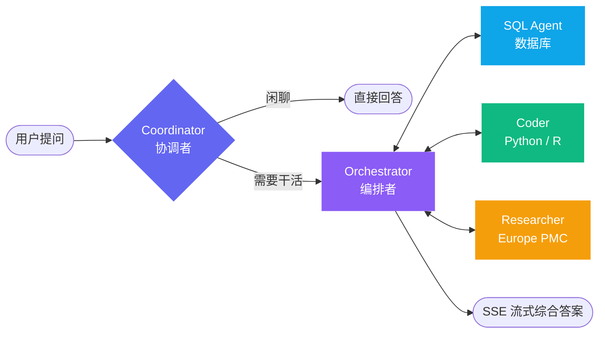

<div align="center">

# 🧬 GenomeChat

**用自然语言对话基因组学数据**

一个面向基因组学研究的全栈多智能体平台 —— 用大白话提问，系统自己规划任务、查询数据库、执行分析代码，然后把综合结论流式返回给你。

[](https://www.python.org/)
[](https://fastapi.tiangolo.com/)
[](https://github.com/langchain-ai/langgraph)
[](https://react.dev/)
[](https://www.typescriptlang.org/)
[](https://vite.dev/)
[](https://www.mongodb.com/)
[](https://www.docker.com/)

### [🚀 在线体验 Demo →](https://xukanz.github.io/genomechat/)

前端完整演示：落地页 → 登录 → 对话。内置示例问答与图表，**无需后端、无需注册**，浏览器直接打开即可。

**简体中文** · [English](./README.en.md)

</div>

---

## ✨ 这是什么

GenomeChat 把「问一个基因组学问题」和「拿到一份带图表、带引文、可复现的答案」之间的所有步骤自动化了。

你问：*「BRCA1 上有多少个致病变异？按分子后果画个分布图。」*

系统会：**规划** → 生成并校验 SQL → **查询** ClinVar → 在沙箱里**执行** Python 画图 → 检索**文献**佐证 → **综合**成一段回答，全程逐 token 流式推送。

<table>
<tr>
<td width="50%" valign="top">

### 🤖 多智能体协作
基于 LangGraph 的五节点图，协调者路由、编排者规划、工作节点执行

</td>
<td width="50%" valign="top">

### 🗄️ 三套公共数据库
ClinVar / GWAS Catalog / Ensembl，运行时热切换，无需重启

</td>
</tr>
<tr>
<td width="50%" valign="top">

### 🔬 安全代码执行
Python 与 R 沙箱独立成服务，非 root、只读根文件系统、资源配额

</td>
<td width="50%" valign="top">

### 📊 全链路可观测
每个节点、工具调用、LLM 请求都有 OpenTelemetry span，落 MongoDB

</td>
</tr>
</table>

---

## 🧠 智能体架构



| 节点 | 职责 |
|---|---|
| 🧭 **Coordinator** | 路由入口。闲聊直接答，真活儿交给编排者 |
| 🎯 **Orchestrator** | 规划多步任务、逐个调度工作节点，最后综合成文 |
| 💻 **Coder** | 在沙箱服务中生成并执行 Python / R |
| 🗃️ **SQL Agent** | 感知 schema 的 SQL 生成，带校验与安全流水线 |
| 📚 **Researcher** | 通过公开的 [Europe PMC](https://europepmc.org/) API 检索文献 |

> **Summarizer 不是节点**，而是挂在编排者上的 `SummarizationMiddleware`。它跑在独立的（更便宜的）模型上，在上下文窗口写满时压缩历史。

所有工作节点执行完都把控制权交还编排者 —— 这是这张图唯一的回边规则。

**研究模式**：`标准` 高效直答 · `深度研究` 多维度迭代深挖，发现结果在智能体之间传递。

---

## 🧬 数据源

三套数据库配置开箱即用，全部由公开基因组学资源本地构建。可在 UI 或 API 中运行时切换。

| 配置 | 来源 | 存储 | 许可 |
|---|---|---|---|
| 🩺 **clinvar** | [NCBI ClinVar](https://www.ncbi.nlm.nih.gov/clinvar/) 变异 / 疾病断言 | SQLite，本地构建 | Public domain |
| 📈 **gwas** | [NHGRI-EBI GWAS Catalog](https://www.ebi.ac.uk/gwas/) 关联 + 研究 | Parquet via DuckDB | CC BY 4.0 |
| 🧾 **ensembl** | [Ensembl](https://www.ensembl.org/) GRCh38 基因注释 | Parquet via DuckDB | EMBL-EBI，无限制 |

首次运行前先构建：

```bash
cd backend
uv run python scripts/build_genomics_databases.py --download
```

<details>
<summary><b>📦 构建细节（磁盘占用、耗时、跳过某个库、升级 Ensembl 版本）</b></summary>

<br>

这会把约 **640 MB** 源文件下载到 `backend/databases/_raw/`，产出：

- `databases/clinvar/clinvar.db` — 约 1.7 GB，450 万行
- `databases/gwas/*.parquet`
- `databases/ensembl/*.parquet` — 约 40 MB

原始下载和构建产物都在 gitignore 里 —— **每次全新 checkout 都要重建**。

ClinVar 构建默认只保留 GRCh38 的行；传 `--clinvar-full` 保留所有参考基因组版本（体积大约翻倍）。

首次运行预留 **20 分钟左右**，大部分时间花在下载上。用 `--skip-clinvar`、`--skip-gwas`、`--skip-ensembl` 跳过单个配置。

`ensembl` 配置基于 **release-116** 的 GTF 构建。版本是写死的而不是跟随 `current`：Ensembl 把版本号烤进了文件名里，一次静默升级会让 schema 描述中标注的行数全部失效。升级到新版本：

```bash
uv run python scripts/build_genomics_databases.py --download \
  --ensembl-release 117 --skip-clinvar --skip-gwas
```

</details>

---

## 🚀 快速开始

### 👀 只想看看长什么样？

不用装任何后端依赖，跑前端 demo 即可 —— 它自带一套模拟的 API，包含落地页、登录页和带示例问答的对话页：

```bash
cd frontend && npm install
npm run dev               # → http://localhost:5173/demo.html
```

也可以直接看[在线版本](https://xukanz.github.io/genomechat/)。想跑真实系统，继续往下看。

### 前置要求

| 必需 | 可选 |
|---|---|
| Python 3.12+ · [uv](https://docs.astral.sh/uv/) | AWS S3（生成文件持久化） |
| Node.js 18+ | R（R 沙箱） |
| MongoDB | Docker |
| 一个 LLM 供应商 | |

> ⚠️ **MongoDB 是硬依赖**，而且不只是存 checkpoint —— 用户账号、会话、项目、报告、文件元数据全在里面。

### 🐳 方式一：Docker Compose（推荐）

```bash
cp backend/.env.example backend/.env
touch sandbox/.env r-sandbox/.env      # compose 要求这两个文件存在
cd docker && docker compose up -d
```

| 服务 | 地址 |
|---|---|
| 🖥️ 前端 | http://localhost:3100 |
| ⚙️ 后端 | http://localhost:8000 |
| 🐍 Python 沙箱 | http://localhost:8080 |
| 📊 R 沙箱 | http://localhost:8081 |
| 🍃 MongoDB | mongodb://localhost:27017 |

> compose 自带一个 MongoDB 服务，数据存在 `mongo-data` 命名卷里。想改用外部实例（Atlas、共享开发库），在启动前于宿主机 shell 里
> `export MONGODB_CONNECTION_STRING=...` 即可覆盖。

### 🔧 方式二：本地开发

<details open>
<summary><b>后端</b></summary>

```bash
cd backend

# 如果还没装 uv
curl -LsSf https://astral.sh/uv/install.sh | sh

uv python pin 3.12
uv sync

cp .env.example .env      # 编辑 .env，见下方环境变量

uv run python scripts/build_genomics_databases.py --download   # 仅首次

uv run python main.py     # → http://localhost:8000
```

</details>

<details>
<summary><b>前端</b></summary>

```bash
cd frontend
npm install
echo "VITE_API_URL=http://localhost:8000" > .env
npm run dev               # → http://localhost:5173
```

</details>

<details>
<summary><b>沙箱（⚠️ 有个坑）</b></summary>

```bash
cd sandbox
uv venv --python 3.12 .venv
uv pip install --python .venv/bin/python -r requirements.txt
SANDBOX_JOBS_DIR=./.sandbox_jobs .venv/bin/python server.py    # → http://localhost:8080
```

`SANDBOX_JOBS_DIR` 只在非 Docker 环境下需要 —— 容器里用默认的 `/sandbox/jobs` tmpfs 挂载。

**必须用 `.venv/bin/python` 启动，不能用裸 `python`。** 任务和服务器跑在同一个解释器下，用系统 Python 启动就等于给智能体一个没有 matplotlib、numpy、pandas 的沙箱 —— 它会在**每一个任务**里尝试 `pip install`，装进一个任务结束就被删掉的目录。

</details>

---

## ⚙️ 配置

`backend/.env.example` 是权威参考，记录了每一个设置项。以下两项**必填**，缺了后端起不来：

```bash
JWT_SECRET_KEY=...             # python -c 'import secrets; print(secrets.token_urlsafe(32))'
MONGODB_CONNECTION_STRING=mongodb://localhost:27017
```

外加 `backend/src/config/agents.py` 所指向的 LLM 供应商凭据。`src/service/llm.py` 支持直连 Anthropic 和 OpenAI，也支持网关形式的 Azure、Bedrock 和 GCP。

<details>
<summary><b>📁 生成文件与 S3 —— 不配会怎样</b></summary>

<br>

S3 是所有智能体产物的存储后端：Coder 画的图、SQL Agent 导出的结果 CSV，以及代码执行期间写出的任何文件。记录落在 MongoDB 的 `files` 集合，通过 `/artifacts` 以预签名 URL 提供下载。

```bash
AWS_ACCESS_KEY_ID=...          # 两个 key 都不填则走 boto3 默认凭据链
AWS_SECRET_ACCESS_KEY=...      # （IAM role、实例 profile、~/.aws/credentials）
AWS_SESSION_TOKEN=...          # 仅临时凭据需要
AWS_DEFAULT_REGION=us-east-1   # 默认值
AWS_DEFAULT_BUCKET=my-bucket   # 不设置就根本不会发生上传
ALLOWED_S3_BUCKETS=a,b         # 可选白名单；不设表示不限
```

**后端和沙箱都需要这些变量。** 后端通过 `settings` 读取（`src/service/s3.py`），沙箱则把自己那份注入到每个任务的受限环境里（`sandbox/server.py`），这样沙箱内运行的代码能直接上传。`AWS_DEFAULT_BUCKET` 只在非空时才透传 —— 空值会被记录并丢弃，日志里表现为 `[ENV] AWS_DEFAULT_BUCKET is not set`。

**不配 S3 也能跑，但有实打实的代价：**

| 影响 | 说明 |
|---|---|
| 📉 大文件被丢弃 | 沙箱把内联 base64 限制在每文件 1 MB，超出直接丢（日志 `Not returning <path>`） |
| 🔥 烧上下文 | 一张 95 KB 的图约等于 127,000 个 base64 字符，约 32K token，全从智能体上下文窗口里扣 |
| 🕳️ 不落盘 | `/artifacts` 永远是空的，重开会话文件也回不来 |

试用够了；但凡每轮会话要出好几张图，就配上 S3。

**自建 S3（MinIO）** —— 设置 `AWS_ENDPOINT_URL` 即可用 S3 兼容服务代替 AWS。MinIO 不需要注册账号，单个二进制就能跑：

```bash
# 下载一次（Linux x86_64；其他平台见 https://min.io/download）
curl -fsSLO https://dl.min.io/server/minio/release/linux-amd64/minio && chmod +x minio

MINIO_ROOT_USER=minioadmin MINIO_ROOT_PASSWORD=minioadmin \
  ./minio server ~/.minio-data --console-address :9001
```

控制台在 http://localhost:9001，在那里建个 bucket，然后让两个服务都指过去 —— `backend/.env` 和 `sandbox/.env` 各需要一份：

```bash
AWS_ENDPOINT_URL=http://localhost:9000
AWS_ACCESS_KEY_ID=minioadmin
AWS_SECRET_ACCESS_KEY=minioadmin
AWS_DEFAULT_BUCKET=genomechat
AWS_DEFAULT_REGION=us-east-1
```

寻址风格是自动处理的：设置 `AWS_ENDPOINT_URL` 会让 boto3 切到 path-style，因为通过 host:port 访问的自建服务无法响应 `http://<bucket>.localhost:9000`。如果你的服务器需要别的行为，用 `AWS_S3_ADDRESSING_STYLE`（`auto` / `path` / `virtual`）覆盖。

在 Docker Compose 下，容器里的 `localhost` 指的是容器自己 —— 用 MinIO 的服务名，或者当 MinIO 跑在宿主机上时用 `host.docker.internal`。

</details>

<details>
<summary><b>📡 可观测性</b></summary>

<br>

每个节点、工具调用、LLM 请求都有 OpenTelemetry span，导出到 MongoDB，也可以选择导出到 Langfuse。属性遵循 OTel GenAI 语义约定，所以第三方看板不需要做转换就能直接渲染。

```bash
OTEL_ENABLED=true
TRACE_STORAGE_ENABLED=true
```

之后在一轮对话结束后请求 `GET /internal/traces`。访问是租户隔离的，有审计、有限流。

</details>

<details>
<summary><b>🪟 上下文窗口管理</b></summary>

<br>

长会话在达到模型输入窗口 **70%** 时自动摘要，过期的工具输出则独立清理。通过 `CONTEXT_*` 系列设置项调整。

</details>

---

## 🧰 智能体可用工具

并不是每个工具都发给每个智能体 —— Coder 拿到文件和代码执行工具，Orchestrator 只拿 `manage_plan`，SQL Agent 拿 schema、采样和 pipeline 工具。

| 类别 | 工具 |
|---|---|
| 🗃️ **数据库** | `execute_sql_query` · `execute_sql_query_and_save` · `get_database_schema` · `get_random_subsamples` |
| 📁 **文件** | `list_files_by_thread` · `list_files_by_type` · `read_file_from_s3` · `list_s3_files` |
| ▶️ **代码执行** | `execute_code`（Python） · `execute_r_code`（R） |
| 📚 **文献** | `search_literature` · `search_by_doi` · `get_paper_citations` · `get_literature_stats` |
| 📋 **规划** | `manage_plan` —— 编排者的待办列表，更新以 plan 事件流式推给 UI |
| 🔎 **SQL 流水线** | `execute_sql_pipeline` —— 智能 SQL 图用它一次调用完成生成、校验、执行 |

---

## 🔌 API

交互式文档在 `/docs`（Swagger UI）和 `/redoc`。

<details>
<summary><b>🔐 认证 <code>/auth</code></b></summary>

| 方法 | 路径 | 说明 |
|---|---|---|
| `POST` | `/auth/register` | 用户注册 |
| `POST` | `/auth/login` | 登录（OAuth2 password flow） |
| `POST` | `/auth/refresh` | 刷新 access token |
| `GET` | `/auth/me` | 当前用户信息 |
| `POST` | `/auth/logout` | 登出 |

</details>

<details>
<summary><b>💬 对话 <code>/chat</code> · <code>/conversations</code></b></summary>

| 方法 | 路径 | 说明 |
|---|---|---|
| `POST` | `/chat` | 同步对话 |
| `POST` | `/chat/stream` | 基于 SSE 的流式对话 |
| `GET` | `/conversations` | 列出调用者的会话（可按项目过滤） |
| `GET` | `/conversations/{id}` | 会话元数据 |
| `GET` | `/conversations/{id}/history` | 回放已存储的消息历史 |
| `PATCH` | `/conversations/{id}` | 重命名 |
| `DELETE` | `/conversations/{id}` | 删除 |

</details>

<details>
<summary><b>🗄️ 数据库 <code>/databases</code></b></summary>

| 方法 | 路径 | 说明 |
|---|---|---|
| `GET` | `/databases` | 列出可用配置 |
| `GET` | `/databases/active` | 当前激活的配置 |
| `GET` | `/databases/{id}` | 配置详情（类型、SQL 方言、领域、示例问题） |
| `POST` | `/databases/{id}/connect` | 切换激活配置 |

</details>

<details>
<summary><b>📂 项目 <code>/projects</code></b></summary>

项目用来归组会话、持有可复用的代码片段，并可以分享给其他用户。

| 方法 | 路径 | 说明 |
|---|---|---|
| `GET` | `/projects` | 列出自己拥有的和被分享的项目 |
| `POST` | `/projects` | 创建 |
| `GET`·`PATCH`·`DELETE` | `/projects/{id}` | 读取、更新、删除（默认项目不可删） |
| `POST` | `/projects/{id}/conversations/{cid}/move` | 在项目间移动会话 |
| `GET`·`POST` | `/projects/{id}/shares` | 列出或授予共享访问 |
| `DELETE` | `/projects/{id}/shares/{user_id}` | 撤销共享访问 |
| `GET`·`POST` | `/projects/{id}/snippets` | 列出或创建注入 coder 提示词的片段 |
| `PUT`·`DELETE` | `/projects/{id}/snippets/{sid}` | 更新或删除片段 |
| `PATCH` | `/projects/{id}/snippets/{sid}/toggle` | 不删除的前提下启用 / 停用 |

</details>

<details>
<summary><b>📎 产物 <code>/artifacts</code></b></summary>

Coder 和 SQL Agent 产出的文件，元数据记在 MongoDB，实体存在 S3。**未配置 S3 时这些接口返回空** —— 见上文「生成文件与 S3」。

| 方法 | 路径 | 说明 |
|---|---|---|
| `GET` | `/artifacts` | 列出生成文件（可按 thread、项目、文件类型、内容类型过滤；分页） |
| `GET` | `/artifacts/{file_id}/download` | 预签名下载 URL |
| `POST` | `/artifacts/batch-download-urls` | 批量获取预签名 URL |

</details>

<details>
<summary><b>📄 报告 <code>/reports</code> · 反馈 <code>/feedback</code> · 用户 <code>/users</code></b></summary>

| 方法 | 路径 | 说明 |
|---|---|---|
| `GET` | `/reports` | 列出已保存的报告 |
| `POST` | `/reports` | 把一条助手回答保存为报告 |
| `GET` | `/reports/check?conversation_id=&message_index=` | 该消息是否已被保存 |
| `GET` | `/reports/conversation/{id}` | 某个会话中保存的报告 |
| `GET`·`PATCH`·`DELETE` | `/reports/{id}` | 读取、更新、删除 |
| `POST` | `/feedback` | 对消息创建或更新点赞 / 点踩 |
| `GET` | `/feedback/message?conversation_id=&message_index=` | 单条消息的反馈 |
| `GET` | `/feedback/conversation/{id}` | 某会话内的全部反馈 |
| `DELETE` | `/feedback/{feedback_id}` | 按 id 删除 |
| `DELETE` | `/feedback/message/{cid}/{index}` | 按消息位置删除 |
| `GET` | `/users/search` | 按邮箱或姓名查用户（项目分享对话框在用） |
| `PATCH` | `/users/me` | 更新调用者的个人资料 |

</details>

<details>
<summary><b>🔬 内部 <code>/internal</code> · 健康检查 <code>/health</code></b></summary>

`/internal` 由 `INTERNAL_OBSERVABILITY_ENABLED` 控制开关。

| 方法 | 路径 | 说明 |
|---|---|---|
| `GET` | `/internal/traces` | 查询捕获的 span |
| `GET` | `/internal/traces/raw` | 原始 transcript 访问；预留给后续阶段，当前返回 `501` |
| `GET` | `/internal/memory` | 查看抽取出的记忆 |
| `POST` | `/internal/memory/consolidate` | 手动触发一次固化 |
| `GET` | `/health` | 健康检查 |
| `GET` | `/health/detailed` | MongoDB 与 Python 沙箱连通性 + 脱敏配置摘要；任一不可达则报 `degraded` |

</details>

---

## 🏗️ 架构

```
genomechat/
├── backend/                     # 平台后端服务
│   ├── src/
│   │   ├── agents/              # LangGraph 智能体（Coordinator / Orchestrator / Coder / SQL Agent）
│   │   ├── api/                 # FastAPI 路由与应用
│   │   ├── config/              # 配置（settings、数据库注册表）
│   │   ├── graph/               # LangGraph 状态与构建器
│   │   ├── models/              # Pydantic 模型
│   │   ├── prompts/             # 智能体系统提示词（含每个数据库的上下文）
│   │   ├── service/
│   │   │   ├── database/        # 连接（SQLite / DuckDB / MySQL / Postgres…）
│   │   │   ├── memory/          # 记忆流水线（Phase 0.5，默认关闭）
│   │   │   └── observability/   # OpenTelemetry 追踪 + MongoDB 导出器
│   │   ├── tools/               # 供智能体使用的 LangChain 工具
│   │   └── utils/               # 工具函数
│   ├── databases/               # 构建产物（见「数据源」）
│   ├── scripts/                 # 数据准备、审计、迁移
│   └── tests/                   # 测试套件
├── frontend/                    # React + TypeScript SPA
├── sandbox/                     # Python 代码执行沙箱（独立服务）
├── r-sandbox/                   # R 代码执行沙箱（独立服务）
├── docker/                      # Docker Compose 文件（dev + prod）
└── docs/                        # 文档
```

### 状态管理

**后端** —— LangGraph checkpoint 存在 MongoDB，thread ID 形如 `{user_id}:{conversation_id}`，数据库注册表支持运行时切换。请求级状态（当前数据库、智能体后端）用 `ContextVar` 承载，因此并发请求之间永远不会串。

**前端** —— Zustand store 分别管理 auth、conversations、projects、databases、artifacts、feedback、reports、snippets 和 UI 状态。

### 流式传输

SSE 承载逐 token 输出、计划更新、智能体 start/end 事件、工具事件，以及生成文件的元数据。

---

## 🔒 安全

- 🔑 JWT 认证 + refresh token；bcrypt 密码哈希
- 🛡️ SQL Agent 校验流水线：LLM 复核、拒绝 DDL、自动加行数上限
- 📦 代码执行隔离在独立容器：非 root、只读根文件系统、tmpfs 临时空间、`no-new-privileges`、PID 上限、逐进程资源限制
- 📋 每个数据库配置独立的表白名单

---

## 🧪 开发

```bash
cd backend

uv run pytest                              # 测试套件
uv run pytest --cov=src --cov-report=html  # 带覆盖率
uv run pytest tests/test_config/test_database_registry.py -v   # 单个文件
uv run ruff format .                       # 格式化
uv run ruff check --fix .                  # lint
uv run mypy src/                           # 类型检查
```

### 命令行工具

不想开前端时可以用交互式 CLI 测试：

```bash
uv run python cli.py                         # 流式、标准模式
uv run python cli.py --no-stream             # 调试时错误信息更清楚
uv run python cli.py --research-mode deep_research
```

命令：`/help` · `/clear` · `/thread` · `/sync` · `/stream` · `/mode standard|deep` · `/login` · `/register` · `/logout` · `/whoami` · `/exit`

---

## 📄 License

本项目基于 [MIT License](./LICENSE) 开源。

> 注：MIT 协议仅适用于本仓库的代码。GenomeChat 使用的外部数据源（ClinVar、GWAS Catalog、Ensembl、Europe PMC 等）各自遵循其原始的使用条款与许可，不在本协议覆盖范围内。

---

## 🙏 致谢

用 [LangGraph](https://github.com/langchain-ai/langgraph)、[LangChain](https://github.com/langchain-ai/langchain)、FastAPI 和 React 构建。

数据来自 [NCBI ClinVar](https://www.ncbi.nlm.nih.gov/clinvar/)、[NHGRI-EBI GWAS Catalog](https://www.ebi.ac.uk/gwas/) 和 [Ensembl](https://www.ensembl.org/)。

文献检索由 [Europe PMC](https://europepmc.org/) 提供支持 —— 一个由 EMBL-EBI 开发和运营的开放文献数据库。

<div align="center">
<br>

**[⬆ 回到顶部](#-genomechat)** · [English](./README.en.md)

</div>
